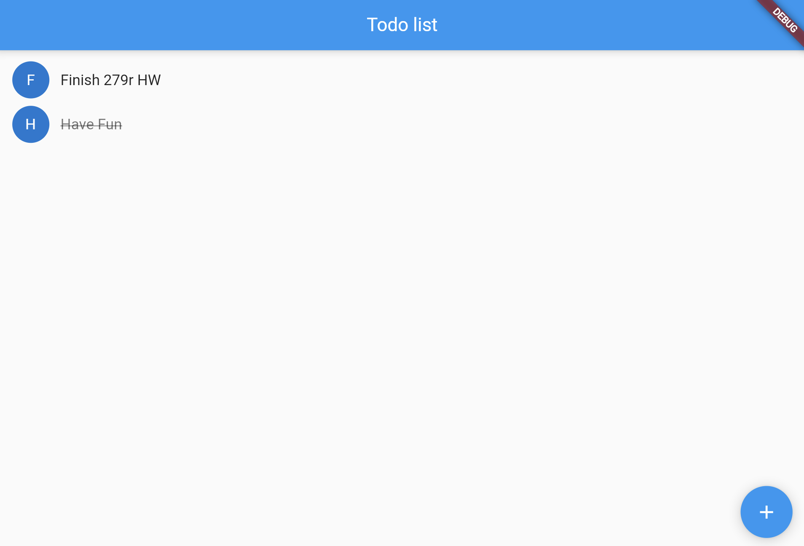

## TODO app using Flutter


## How To Use

To clone and run this application, you'll need [Git](https://git-scm.com) and [Flutter](https://flutter.dev/docs/get-started/install) installed on your computer. From your command line:

```bash
# Clone this repository
$ git clone https://github.com/pcsong33/flutter-app.git

# Go into the repository
$ cd flutter-app

# Install dependencies
$ flutter packages get

# Run the app
$ flutter run
```
